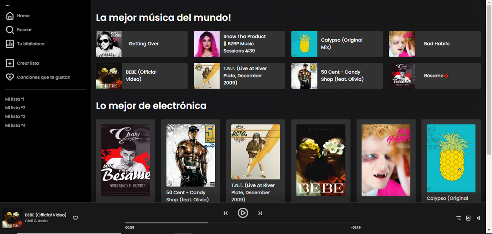

## Spotify clone

This project was generated with [Angular CLI](https://github.com/angular/angular-cli) version 16.2.3.

## Tech Stack

- AuthGuard.
- LazyLoad.
- Routes and navigation.
- Reactive forms.
- Styles with CSS.

## Functionalities

- Login with email and password.
- Song reproduction.
- Searcher.

## Deployment

The project was deployed using Vercel.
[SpotifyClone](https://spotify-clone1-eight.vercel.app/)

## Usage

**IMPORTANT:** The project was developed using **npm 9.5.1 version**. Please, check your npm version to avoid problems.

To run the project locally follow the next steps:

1. Clone the project: `git clone https://github.com/JulianaCotabarren/node-apiTracks`

2. Go to the project directory: `cd nodeApiTracks`

3. Install dependencies: `npm install`

4. Run the app in the development mode: `node app.js`

5. Clone the project: `git clone https://github.com/JulianaCotabarren/spotify-clone`

6. Go to the project directory: `cd spotify`

7. Install dependencies: `npm install`

8. Run the app in the development mode: `ng serve`

9. Navigate to `http://localhost:4200/`.

10. Login with _email: test@test.com_ and _password: 12345678_

## Website Images

